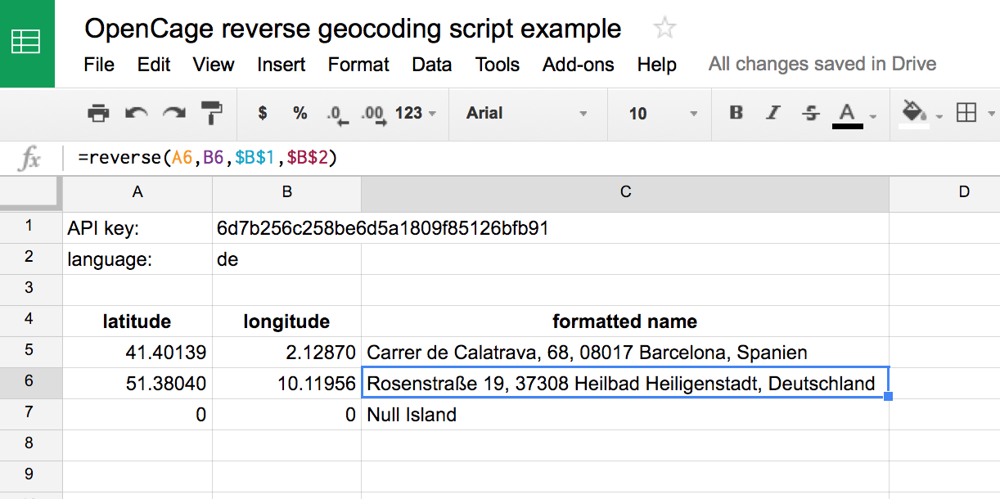

You can use Google Sheets and the [OpenCage Geocoder](https://geocoder.opencagedata.com) to quickly convert a list of coordinates to placenames (reverse geocoding) or vice versa (forward geocoding).

1. register for an OpenCage Geocoder API key
2. create a new Sheet
3. open Tools > Scripts editor
4. If you want to convert coordinates into placenames copy the script [reverse.js](reverse.js) into the scripts editor and save
5. In your sheet use 
```
=reverse(longitude,latitude,api_key,language)
```
`language` is optional, but if used should be a language code [as per the API docs](https://geocoder.opencagedata.com/api#forward-opt).


