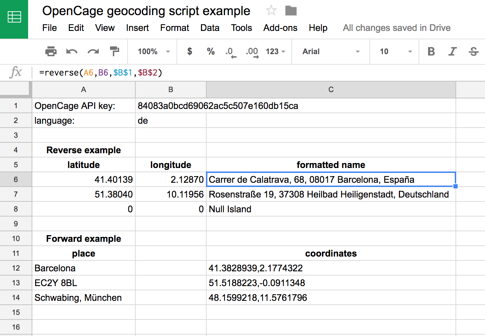

You can use Google Sheets and the [OpenCage Geocoder](https://geocoder.opencagedata.com) to quickly convert a list of coordinates to placenames (reverse geocoding) or vice versa (forward geocoding).

1. register for an OpenCage Geocoder API key ([signup here](https://geocoder.opencagedata.com/users/sign_up))

2. create a new Sheet

3. open Tools > Scripts editor

4. copy the script [opencage.js](opencage.js) into the scripts editor and save

5. If you want to convert coordinates into placenames use the `reverse` function
   with the following parameters:

```
=reverse(longitude,latitude,api_key,language)
```

   If you want to convert placenames into coordinates use the `forward` function
   with the following parameters:

```
=forward(place,api_key,language)
```

Note that in both cases `language` is optional, but if used should be a language code [as per the API docs](https://geocoder.opencagedata.com/api#forward-opt).


Here is a revere example:

