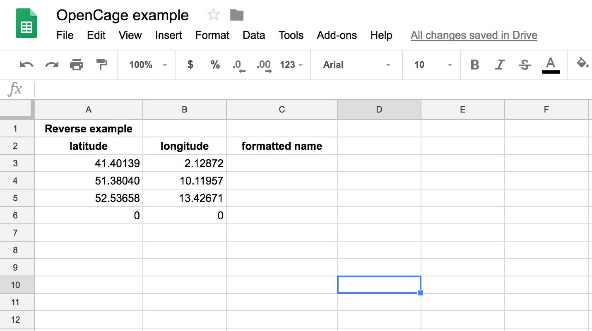
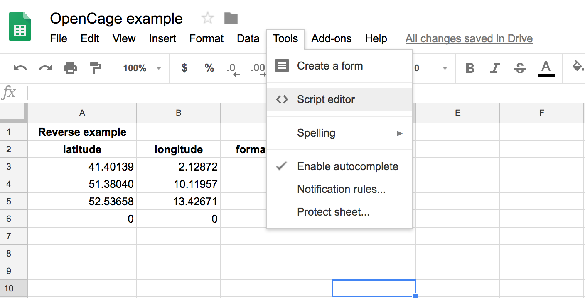
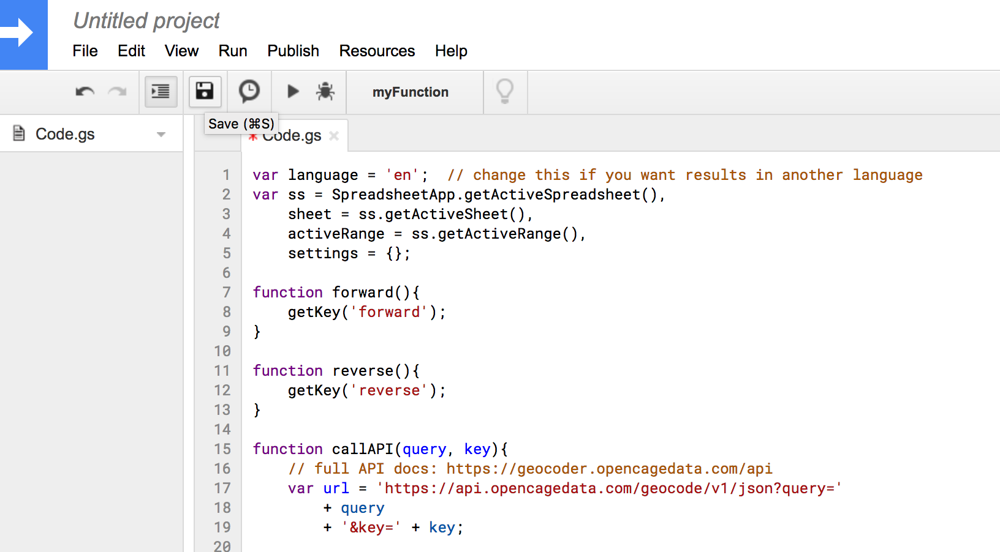
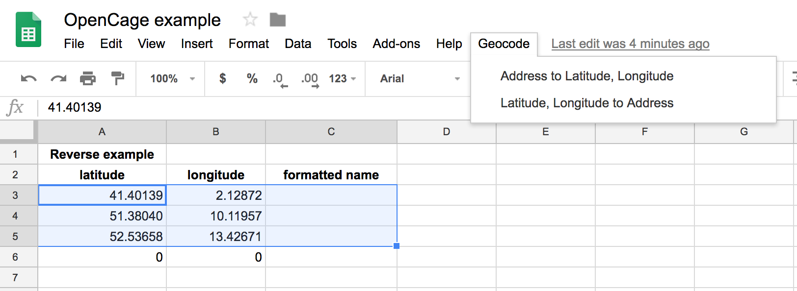
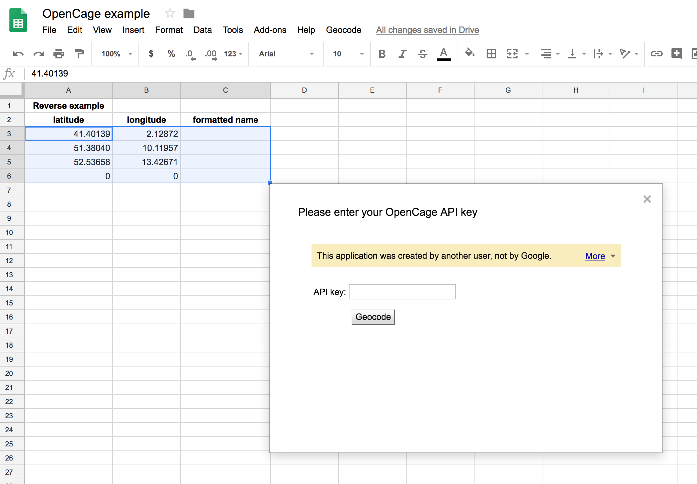
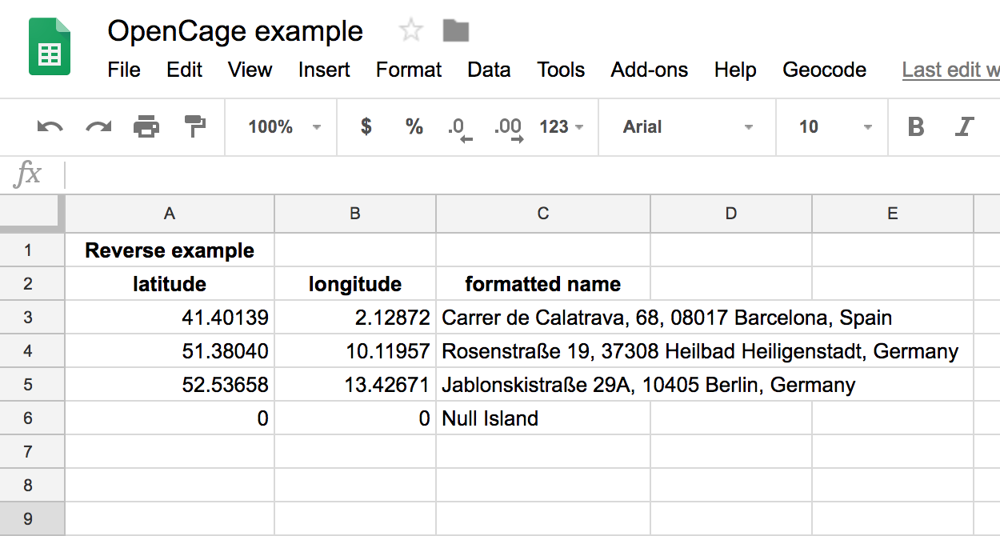

You can use Google Sheets and the [OpenCage Geocoder](https://geocoder.opencagedata.com) to quickly convert a list of coordinates to placenames (reverse geocoding) or vice versa (forward geocoding).

1. register for an OpenCage Geocoder API key ([signup here](https://geocoder.opencagedata.com/users/sign_up))

2. create a new Sheet

Put you addresses in a column, or your coordinates in two columns (latitude, longitude)



3. open Tools > Scripts editor



4. copy the script [opencage.js](opencage.js) into the scripts editor and save.



5. Reload your Google Sheet. After a few seconds a new "Geocode" button should appear



6. Select three columns, and then click on "Latitude, Longitude to Address"

  * You will be prompted to give the script access to your Google docs. You will need to select yes.

  * A popup will appear asking your for your API key. Enter it and click "Geocode"



7. The results will appear in the third column you selected.




5. If you want to convert coordinates into placenames use the `reverse` function
   with the following parameters:

```
=reverse(longitude,latitude,api_key,language)
```

   If you want to convert placenames into coordinates use the `forward` function
   with the following parameters:

```
=forward(place,api_key,language)
```

Note that in both cases `language` is optional, but if used should be a language code [as per the API docs](https://geocoder.opencagedata.com/api#forward-opt).


Here is an example:


